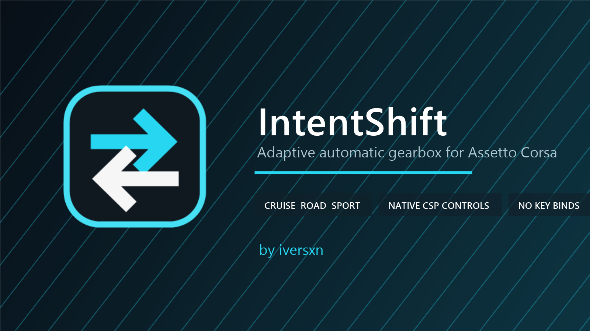

# IntentShift

IntentShift is an adaptive automatic gearbox app for Assetto Corsa. It reads
driver demand, engine speed, braking and wheel slip, then shifts through CSP's
native car-control interface. No keyboard input is generated and no key binds
are required.

## Features

- Cruise, Road and Sport shift profiles
- Progressive shift points based on live throttle and braking intent
- Kickdown response and braking-aware downshifts
- Wheel-slip protection and anti-hunting timing guards
- Per-car RPM calibration from live physics data
- Persistent profile selection
- Lightweight CSP Lua implementation
- Manual standby mode for immediate hand-back to the driver

## Requirements

- Assetto Corsa (PC)
- Custom Shaders Patch `0.3.0-preview581` (build 4116) or newer
- Content Manager is recommended

## Installation

1. Download `IntentShift-v1.0.0.zip` from the Releases page.
2. Drag the ZIP into Content Manager and choose **Install**.
3. Disable Assetto Corsa's built-in automatic shifting and any other automatic
   gearbox apps.
4. Start a driving session and open **IntentShift** from the app sidebar.
5. Click the profile button to choose Cruise, Road or Sport.

For a manual installation, copy the `apps` folder from the release package into
the main `assettocorsa` directory.

## Profiles

| Profile | Character |
| --- | --- |
| Manual | Monitoring only; the driver controls every shift |
| Cruise | Early, relaxed shifts for traffic and free-roam driving |
| Road | Balanced response for everyday driving |
| Sport | Higher shift points and faster kickdown response |

IntentShift works best with sequential and paddle-shift cars. Results can vary
with unusual drivetrains or cars that run their own transmission scripts.

## How it works

The controller filters pedal input into a demand signal, maps that signal to a
car-relative RPM window, and applies timing and traction guards before issuing a
single native upshift or downshift command. Because it writes directly to CSP's
car controls, it cannot trigger unrelated actions assigned to keyboard keys.

## Development

Run the automated test suite from the repository root:

```powershell
python -m pip install -r requirements-dev.txt
python -m unittest discover -s tests -v
```

Build the Content Manager package:

```powershell
powershell -ExecutionPolicy Bypass -File tools/build.ps1
```

## License

IntentShift is released under the [MIT License](LICENSE).
